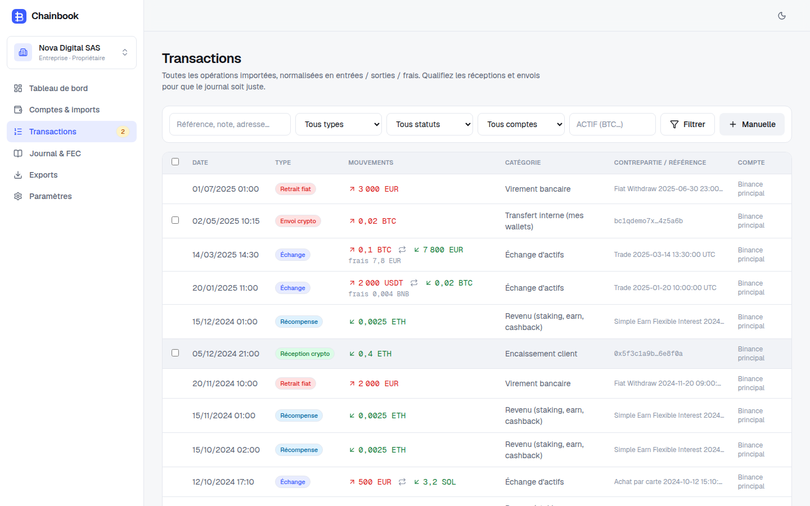
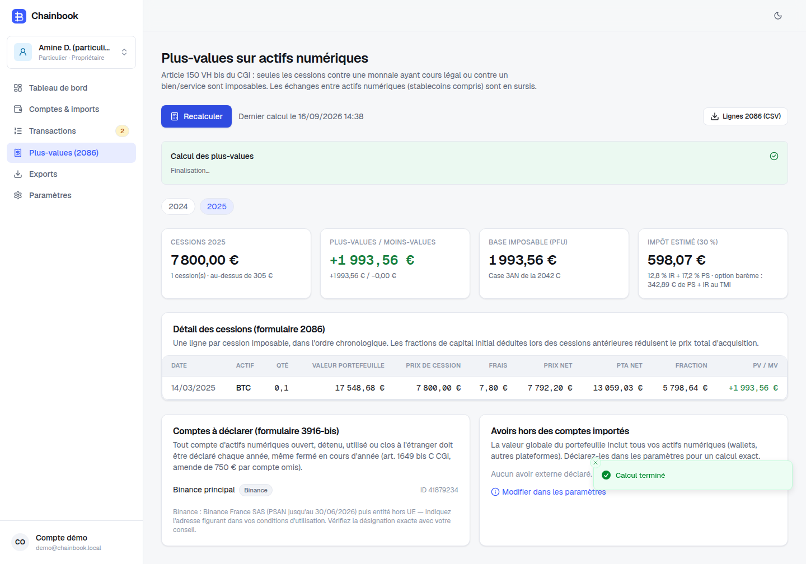

# Chainbook — comptabilité crypto au format FEC

Application web multi-dossiers qui transforme l'historique d'un compte d'échange (Binance par API ou par export CSV) en :

- un **journal comptable conforme au PCG 2025** (règlement ANC 2018-07 consolidé : comptes 522, 7674/6674, 4742/4752, provision pour pertes latentes), équilibré, numéroté sans rupture, avec écritures d'inventaire et contre-passation ;
- un **FEC** (art. A47 A-1 du LPF) nommé `SIRENFECAAAAMMJJ.txt`, séparateur `|`, validé avant téléchargement (balance, séquence, dates, formats) ;
- pour les particuliers, le **calcul des plus-values de l'article 150 VH bis** du CGI (prix total d'acquisition, fractions de capital initial, seuil de 305 €, PFU 30 %) et les lignes du **formulaire 2086**, plus la liste des comptes pour le **3916-bis** ;
- un tableau de bord (valeur du portefeuille, positions, flux), une revue des opérations à qualifier, des exports CSV (écritures, balance, transactions, plan de comptes).

Ce dépôt est la réécriture, en application web, du notebook *« Gestion comptable et financière sur Binance : comment créer un journal comptable des opérations réalisées au format FEC ? »*. Les trois documents demandés sont dans `docs/` :

| Document | Contenu |
| --- | --- |
| [`docs/CE_QUI_MANQUE.md`](docs/CE_QUI_MANQUE.md) | Ce que le notebook ne couvrait pas, ce que l'application corrige, ce qui reste à faire |
| [`docs/AUDIT_REGLEMENTAIRE.md`](docs/AUDIT_REGLEMENTAIRE.md) | Audit réglementaire : PCG/ANC, FEC, fiscalité des particuliers et des sociétés, MiCA/PSAN, DAC8, RGPD, monopole de l'expertise comptable, sécurité |
| [`docs/STRATEGIE_CONCURRENTIELLE.md`](docs/STRATEGIE_CONCURRENTIELLE.md) | Positionnement face à Waltio, Koinly, Cryptio, ComptaCrypto, Blockpit… et feuille de route |

## Aperçu

| Tableau de bord | Journal & FEC |
| --- | --- |
|  |  |

| Transactions | Plus-values des particuliers |
| --- | --- |
|  |  |

Le fichier [`docs/demo-FEC-2025.txt`](docs/demo-FEC-2025.txt) est le FEC produit sur les données de démonstration (exercice 2025 de la société fictive « Nova Digital SAS », SIREN fictif).

## Pile technique

Next.js 16 (App Router, Server Actions, Turbopack) · React 19 · TypeScript strict · Tailwind CSS 4 · Auth.js v5 (Google OAuth) · Drizzle ORM sur PostgreSQL (PGlite embarqué en développement) · decimal.js pour tous les montants · Vitest · Playwright.

```
src/lib/engine/        moteur comptable pur (aucune dépendance à la base ni au réseau)
  model.ts             modèle canonique : une opération = jambes IN / OUT / FEE
  valuation.ts         table de cours et valorisation en euros (référence : EUR > fiat > stablecoin > BTC/ETH/BNB)
  costbasis.ts         coût moyen pondéré (CUMP) et PEPS (FIFO) — art. 619-15 PCG
  chart.ts             plan de comptes par défaut et attribution des sous-comptes 522xxx
  journal.ts           génération des écritures (opérations, inventaire, extournes, appariement des transferts internes)
  fec.ts / fecbuild.ts écriture, validation et relecture d'un FEC
  individual.ts        régime des particuliers (art. 150 VH bis, formulaire 2086)
  portfolio.ts         positions, valorisation, courbe de valeur
src/lib/connectors/binance/  client REST signé, synchronisation complète, normalisation, import CSV
src/lib/pricing/       fournisseurs de cours (klines Binance, taux BCE, CoinGecko en secours) et cache
src/lib/db/            schéma Drizzle (multi-dossiers, comptes chiffrés, transactions, cours, exercices, journaux, jobs, audit)
src/lib/dal/           accès aux données avec contrôle des droits par dossier
src/lib/services/      synchronisation, import, génération du journal, fiscalité, tableau de bord
src/app/               pages (landing, connexion, onboarding, tableau de bord, comptes, transactions, journal, fiscalité, exports, paramètres)
tests/                 tests unitaires du moteur, de l'import CSV, du client API et du chiffrement
```

## Démarrer en local

```bash
cp .env.example .env.local        # AUTH_SECRET, APP_ENCRYPTION_KEY, AUTH_DEV_LOGIN=true
npm install
npm run seed                      # données de démonstration (utilisateur demo@chainbook.local)
npm run dev                       # http://localhost:3000 → « Entrer sans Google »
npm test                          # 28 tests
```

Sans `DATABASE_URL`, une base PostgreSQL embarquée (PGlite) est créée dans `.data/pglite` et migrée automatiquement.

### Connexion Google

1. Google Cloud Console → *APIs & Services* → *Credentials* → *OAuth client ID* (application web).
2. URI de redirection autorisée : `https://<votre-domaine>/api/auth/callback/google` (et `http://localhost:3000/api/auth/callback/google` en local).
3. Renseignez `AUTH_GOOGLE_ID` et `AUTH_GOOGLE_SECRET`.

## Déploiement sur Render

Le fichier [`render.yaml`](render.yaml) décrit un service web Node (région Francfort) et une base PostgreSQL managée. Dans le tableau de bord Render : *New → Blueprint*, choisir ce dépôt, puis renseigner `AUTH_URL` (URL publique du service), `AUTH_GOOGLE_ID`, `AUTH_GOOGLE_SECRET`. `AUTH_SECRET`, `APP_ENCRYPTION_KEY` et `DATABASE_URL` sont générés automatiquement ; les migrations s'appliquent au démarrage.

Pourquoi Francfort : Binance refuse les requêtes depuis certaines adresses IP (HTTP 451, observé depuis un conteneur américain pendant le développement). Les synchronisations tournent dans le processus web (Render conserve un processus persistant) ; sur une plateforme serverless il faudrait une file de tâches.

## Régimes couverts

| | Entreprise (IS/BIC) | Particulier |
| --- | --- | --- |
| Base | PCG art. 619-10 à 619-17, CMP ou PEPS | CGI art. 150 VH bis |
| Fait générateur | Toute cession, y compris crypto ↔ crypto | Cession contre monnaie ayant cours légal ou contre un bien/service |
| Sorties | Journal, balance, inventaire, FEC, plan de comptes | Lignes 2086, synthèse annuelle (PFU 30 %), comptes 3916-bis |

## Sécurité

- Clés API demandées **en lecture seule**, testées avant enregistrement, chiffrées AES-256-GCM (`APP_ENCRYPTION_KEY`), jamais renvoyées au navigateur (seuls les 4 derniers caractères le sont).
- Contrôle d'accès par dossier et par rôle (propriétaire, administrateur, comptable, lecture) dans la couche d'accès aux données, en plus de la protection des routes.
- Journal d'audit (imports, requalifications, générations, exports), en-têtes de sécurité HTTP, mode démo désactivable (`AUTH_DEV_LOGIN=false` en production).

## Limites connues

Voir [`docs/CE_QUI_MANQUE.md`](docs/CE_QUI_MANQUE.md). En résumé : le client API Binance a été écrit à partir de la documentation officielle et testé avec des réponses simulées (Binance bloque le réseau du conteneur de développement) ; les frais des dépôts *on-chain* ne sont connus que si le wallet émetteur est suivi ; l'envoi d'e-mails d'invitation n'est pas branché (le lien est fourni à copier).
