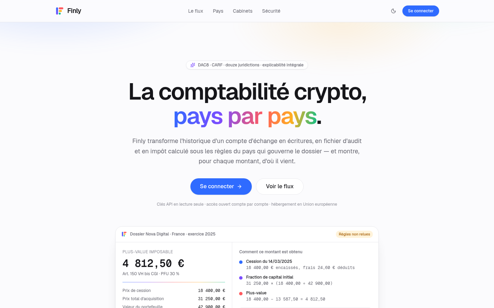
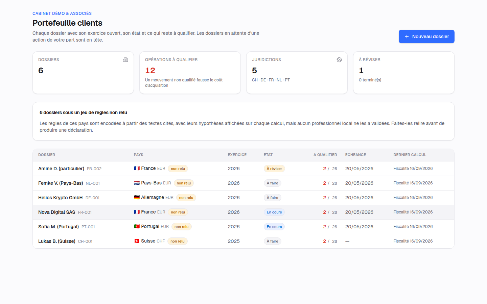
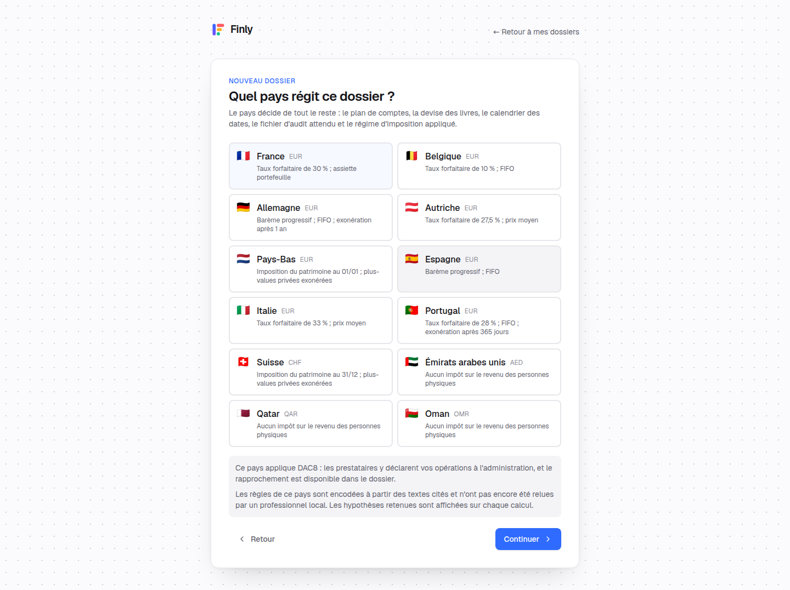
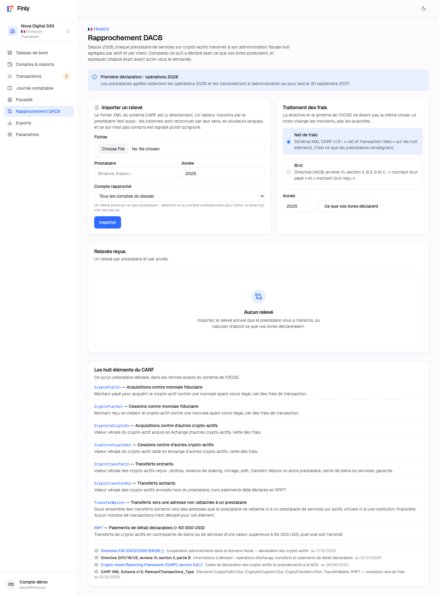
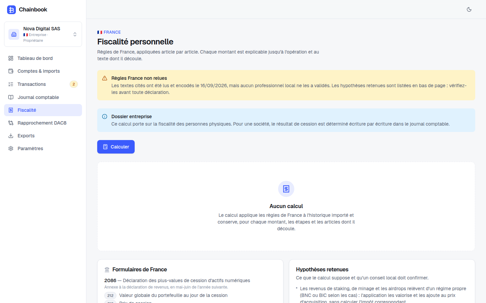
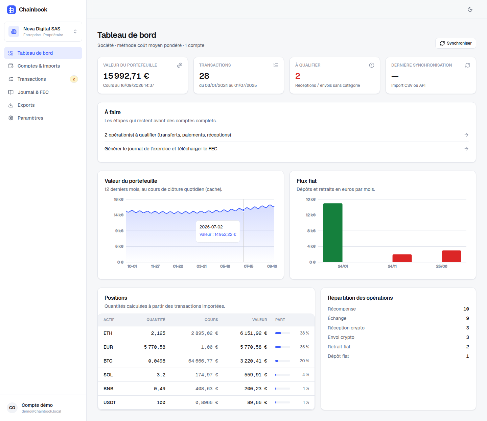
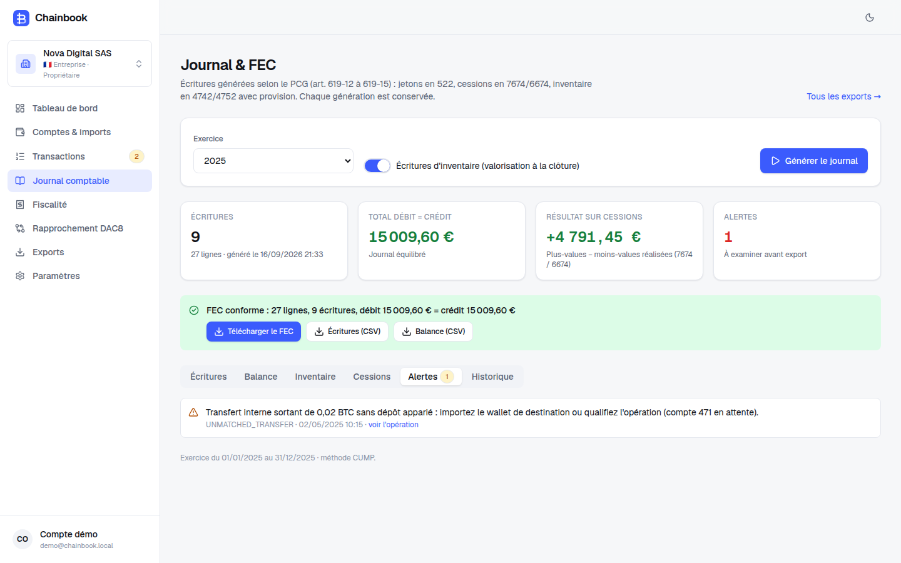
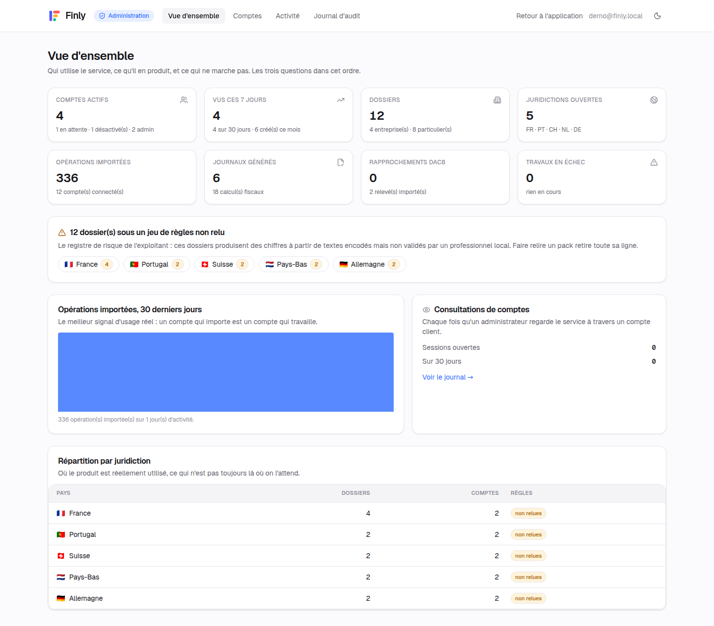
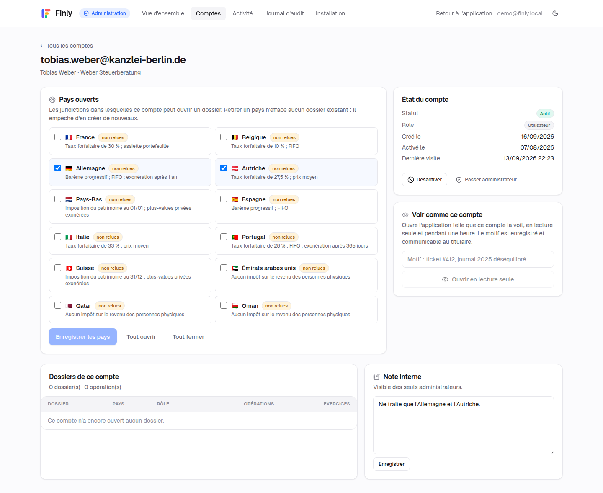

# Finly — comptabilité et fiscalité crypto, douze juridictions

Application web multi-dossiers, destinée aux cabinets d'expertise comptable et à leurs clients. Elle transforme l'historique de comptes d'échange et de portefeuilles en écritures comptables, en déclarations fiscales et en un rapprochement DAC8, sous les règles du pays qui gouverne le dossier.

**🇫🇷 France · 🇧🇪 Belgique · 🇩🇪 Allemagne · 🇦🇹 Autriche · 🇳🇱 Pays-Bas · 🇪🇸 Espagne · 🇮🇹 Italie · 🇵🇹 Portugal · 🇨🇭 Suisse · 🇦🇪 Émirats arabes unis · 🇶🇦 Qatar · 🇴🇲 Oman**

Ce qu'elle produit :

- un **journal comptable** selon le plan de comptes du pays (PCG français et ses comptes 522/7674/6674/4742/4752, SKR 04, EKR autrichien, PGC espagnol, SNC portugais, PCMN belge, RGS néerlandais, KMU suisse, IFRS pour le Golfe), équilibré, numéroté sans rupture ;
- le **fichier d'audit** que ce pays attend : FEC français, lot d'écritures DATEV, SAF-T (PT) 1.04_01, XAF 3.2, ou journal générique ;
- le **calcul de l'impôt personnel** sous les règles réelles de chaque juridiction, avec les cases des formulaires locaux ;
- le **rapprochement DAC8**, qui compare le relevé du prestataire aux agrégats recalculés et explique chaque écart ;
- l'**explicabilité** : chaque montant se déplie jusqu'à l'opération et à l'article dont il découle, et ce détail est conservé avec le calcul.

Ce dépôt est né de la réécriture, en application web, du notebook *« Gestion comptable et financière sur Binance : comment créer un journal comptable des opérations réalisées au format FEC ? »*. Les documents d'analyse sont dans `docs/` :

| Document | Contenu |
| --- | --- |
| [`docs/ANNEXE_MULTIPAYS.md`](docs/ANNEXE_MULTIPAYS.md) | Ce que chaque juridiction impose, article par article : tableau de divergence, pièges par pays, DAC8, fichiers d'audit |
| [`docs/CE_QUI_MANQUE.md`](docs/CE_QUI_MANQUE.md) | Ce que le notebook ne couvrait pas, ce que l'application corrige, ce qui reste à faire |
| [`docs/AUDIT_REGLEMENTAIRE.md`](docs/AUDIT_REGLEMENTAIRE.md) | Audit réglementaire français : PCG/ANC, FEC, fiscalité, MiCA/PSAN, DAC8, RGPD, monopole de l'expertise comptable |
| [`docs/STRATEGIE_CONCURRENTIELLE.md`](docs/STRATEGIE_CONCURRENTIELLE.md) | Positionnement face à Waltio, Koinly, Cryptio, ComptaCrypto, Blockpit… et feuille de route |

## Les trois moteurs

Un pays est un fichier de données, pas un moteur. Les douze jeux de règles alimentent trois calculateurs :

| Moteur | Ce qu'il calcule | Pays |
| --- | --- | --- |
| Gains lot par lot | Méthode de coût, exonérations de durée, report de coût sur échanges non imposés, franchises, report des pertes | DE, AT, ES, IT, PT, BE, AE, OM, QA |
| Assiette portefeuille | La formule de l'article 150 VH bis, qui rapporte la cession à la valeur globale du portefeuille | FR |
| Patrimoine à une date | Position détenue à la date de référence, rendement forfaitaire ou impôt cantonal sur la fortune | NL, CH |

Les douze packs portent le statut **DRAFT** : ils sont écrits à partir des textes cités, pas validés par un professionnel local, et l'interface l'affiche sur chaque calcul avec la liste des hypothèses retenues.

## Aperçu



| Portefeuille clients | Choix du pays |
| --- | --- |
|  |  |

| Rapprochement DAC8 | Fiscalité et explicabilité |
| --- | --- |
|  |  |

| Tableau de bord | Journal comptable |
| --- | --- |
|  |  |

| Console d'administration | Droits d'un compte |
| --- | --- |
|  |  |

Les captures se reproduisent avec `npm run seed`, puis `npm run demo` (qui lance les calculs), puis `npx tsx scripts/screenshots.ts`.

Le fichier [`docs/demo-FEC-2025.txt`](docs/demo-FEC-2025.txt) est le FEC produit sur les données de démonstration (exercice 2025 de la société fictive « Nova Digital SAS », SIREN fictif).

## Identité

La marque est un **F construit avec quatre pilules** : une hampe, deux bras de longueur décroissante et un point là où un troisième bras s'arrêterait — le point du « i », emprunté. Les cinq couleurs de la marque n'apparaissent ensemble qu'ici.

| Jeton | Clair | Sombre | Emploi |
| --- | --- | --- | --- |
| `--brand-blue` | `#2F6BFF` | `#6D93FF` | Couleur d'action : boutons, liens, sélection |
| `--brand-violet` | `#7C4DFF` | `#A488FF` | Second accent, dégradé de la hampe, sections cabinet |
| `--brand-coral` | `#FF5A5F` | `#FF8084` | Accent chaud, bras supérieur, étapes |
| `--brand-amber` | `#FFB020` | `#FFC45C` | Attention, règles non relues, point de l'icône |
| `--brand-mint` | `#06BF8B` | `#3AD9A8` | Confirmation, sécurité, éléments rapprochés |

La règle qui tient l'ensemble : **la couleur ne teinte jamais la surface**. L'interface reste blanche ou presque noire, deux gris pour le texte ; les cinq couleurs servent aux marques, aux états et aux données. Un écran plein de chiffres se lit donc en noir sur blanc — c'est ce qu'on demande à un logiciel qu'on regarde une heure d'affilée.

Les jetons vivent dans [`src/app/globals.css`](src/app/globals.css), la marque dans [`src/components/logo.tsx`](src/components/logo.tsx), l'icône d'application dans [`src/app/icon.svg`](src/app/icon.svg).

## Pile technique

Next.js 16 (App Router, Server Actions, Turbopack) · React 19 · TypeScript strict · Tailwind CSS 4 · Auth.js v5 (Google OAuth) · Drizzle ORM sur PostgreSQL (PGlite embarqué en développement) · decimal.js pour tous les montants · Vitest · Playwright.

```
src/lib/engine/        moteur comptable pur (aucune dépendance à la base ni au réseau)
  model.ts             modèle canonique : une opération = jambes IN / OUT / FEE
  valuation.ts         table de cours et valorisation (référence : EUR > fiat > stablecoin > BTC/ETH/BNB)
  fx.ts                rebasage de la table de cours vers CHF, AED, QAR, OMR… et parités officielles du Golfe
  trace.ts             arbre d'explication : étape, formule, entrées, sortie, référence légale
  costbasis.ts         coût moyen pondéré et PEPS
  chart.ts             structure d'un plan de comptes et attribution des sous-comptes par jeton
  journal.ts           génération des écritures (opérations, inventaire, extournes, transferts internes)
  fec.ts / fecbuild.ts écriture, validation et relecture d'un FEC
  tz.ts                calendrier comptable : une opération de 23 h 30 UTC le 31 décembre s'impute au 1er janvier
  tax/lots.ts          registre de lots : FIFO, LIFO, HIFO, prix moyen, suivi par portefeuille, grandfathering
  tax/gains.ts         moteur de gains piloté par les règles du pack
  tax/wealth.ts        moteur patrimonial (Pays-Bas, Suisse)
  tax/fr.ts            formule de l'article 150 VH bis
src/lib/countries/     douze packs : règles, plans de comptes, formulaires, références légales, hypothèses
src/lib/dac8/          agrégats CARF, lecture des relevés CSV et XML, rapprochement expliqué
src/lib/exports/       FEC, DATEV EXTF, SAF-T (PT), XAF (NL), journal générique
src/lib/connectors/    Binance (API signée et CSV) et lecteurs Coinbase, Kraken, Bitvavo, Bitpanda,
                       Crypto.com, Bitstamp, Ledger Live, plus un modèle générique, avec détection automatique
src/lib/pricing/       fournisseurs de cours (klines Binance, taux BCE, CoinGecko en secours) et cache
src/lib/db/            schéma Drizzle (cabinets, dossiers, comptes chiffrés, transactions, cours, exercices,
                       journaux, relevés DAC8, calculs fiscaux, jobs, audit)
src/lib/authz.ts       rôles de plateforme, états de compte, droits pays (pur, testable)
src/lib/dal/           accès aux données avec contrôle des droits par dossier, comptes et consultations
src/lib/services/      contexte pays, synchronisation, import, journal, fiscalité, DAC8, fichiers d'audit,
                       cockpit du cabinet, administration de la plateforme (mesures, comptes, audit)
src/lib/i18n.ts        chaînes d'interface FR/EN (le vocabulaire juridique reste dans les packs, en langue locale)
src/app/               pages, dont le portefeuille clients, le rapprochement DAC8 et la console /admin
tests/                 moteurs, packs pays, lecteurs CSV, DAC8, fichiers d'audit, chiffrement, droits de plateforme
```

## Démarrer en local

```bash
cp .env.example .env.local        # AUTH_SECRET, APP_ENCRYPTION_KEY, AUTH_DEV_LOGIN=true
npm install
npm run seed                      # données de démonstration (utilisateur demo@finly.local)
npm run dev                       # http://localhost:3000 → « Entrer sans Google »
npm test                          # 143 tests
```

Sans `DATABASE_URL`, une base PostgreSQL embarquée (PGlite) est créée dans `.data/pglite` et migrée automatiquement.

`npm run seed` crée `demo@finly.local` en administrateur de plateforme, plus quatre comptes de cabinet dans les quatre états possibles. Sur une base vierge, le premier administrateur vient de `SUPER_ADMIN_EMAILS` (voir ci-dessous).

### Connexion Google

1. Google Cloud Console → *APIs & Services* → *Credentials* → *OAuth client ID* (application web).
2. URI de redirection autorisée : `https://<votre-domaine>/api/auth/callback/google` (et `http://localhost:3000/api/auth/callback/google` en local).
3. Renseignez `AUTH_GOOGLE_ID` et `AUTH_GOOGLE_SECRET`.

## Déploiement sur Render

**Rien à renseigner.** Dans le tableau de bord Render : *New → Blueprint*, choisir ce dépôt, *Deploy*. Le blueprint [`render.yaml`](render.yaml) crée la base PostgreSQL, génère les secrets et démarre le service ; les migrations s'appliquent au démarrage.

Ensuite, deux minutes :

1. **Prenez la main.** Render → service `finly` → *Environment* → copiez `ADMIN_BOOTSTRAP_CODE`. Ouvrez l'URL du service : l'écran de connexion demande ce code, et vous devenez administrateur de la plateforme. Le code cesse de fonctionner dès qu'un administrateur existe.
2. **Finissez depuis la console.** *Administration → Installation* liste ce qui manque encore et affiche l'URI de redirection à coller chez Google. Vous y collez l'identifiant et le secret du client OAuth : la connexion Google fonctionne à la requête suivante, sans redéploiement. Le client est chiffré en base, comme les clés d'échange.

Ce qui n'est **pas** demandé, et pourquoi :

| Variable | Pourquoi elle a disparu |
| --- | --- |
| `AUTH_URL` | Auth.js déduit son URL de la requête (`trustHost`), donc le service fonctionne sur le nom d'hôte que Render lui donne. |
| `AUTH_GOOGLE_ID` / `AUTH_GOOGLE_SECRET` | Se collent dans la console. Renseignées dans l'environnement, elles l'emportent. |
| `SUPER_ADMIN_EMAILS` | Le code de démarrage suffit au premier administrateur. La variable reste utilisable. |
| `COINGECKO_API_KEY` | Facultative ; la console la prend aussi. |

Pourquoi Francfort : Binance refuse les requêtes depuis certaines adresses IP (HTTP 451, observé depuis un conteneur américain pendant le développement). Les synchronisations tournent dans le processus web (Render conserve un processus persistant) ; sur une plateforme serverless il faudrait une file de tâches.

## Accès et administration

**Il n'y a pas d'inscription libre.** Une adresse que personne n'a créée est refusée, même avec un compte Google valide : `signIn` interroge la table des comptes avant d'ouvrir la session et renvoie vers `/login?denied=…`. Ce choix est ce qui rend le reste tenable — un service qui calcule l'impôt de tiers ne peut pas laisser n'importe qui ouvrir un dossier.

Deux rôles seulement, et un seul crée des comptes :

| | Utilisateur | Administrateur de plateforme |
| --- | --- | --- |
| Créer un compte | non | oui, c'est le seul |
| Activer / désactiver un compte | non | oui |
| Ouvrir un pays à un compte | non | oui |
| Voir les dossiers d'un autre compte | non | oui, en lecture seule et journalisé |
| Voir les mesures de la plateforme | non | oui |

**Le premier administrateur** ne peut pas être créé par un administrateur, alors il y a deux portes :

- **Le code de démarrage** (`ADMIN_BOOTSTRAP_CODE`, douze caractères au minimum, généré par le blueprint Render) : sur l'écran de connexion, celui qui le détient prend la main. La porte se ferme d'elle-même dès qu'un administrateur actif existe, les tentatives sont limitées à cinq par adresse et par dix minutes, et la comparaison se fait en temps constant.
- **`SUPER_ADMIN_EMAILS`** (adresses séparées par des virgules) : créées et promues à chaque connexion. L'environnement fait autorité — une adresse qui y figure retrouve ses droits même si la ligne en base dit le contraire, ce qui évite de se verrouiller dehors.

L'écran **Administration → Installation** dit à tout moment ce qui manque : base managée ou embarquée, clé de chiffrement, connexion Google, nombre d'administrateurs, mode démonstration, source de cours.

**Les quatre états d'un compte** : `INVITED` (créé, pas encore activé — la connexion est refusée), `ACTIVE`, `SUSPENDED` (refusée, avec le motif), et la suppression, qui n'existe pas : un compte désactivé conserve ses dossiers et son journal d'audit.

**Les pays sont donnés compte par compte.** Chaque compte porte la liste des juridictions dans lesquelles il peut ouvrir un dossier ; `assertCountryAllowed` la vérifie dans la couche d'accès aux données, pas seulement dans l'écran. Retirer un pays n'efface aucun dossier existant : la console signale alors les dossiers devenus orphelins plutôt que de les détruire.

**« Voir comme »** ouvre l'application telle que le compte la voit. Le motif est obligatoire (huit caractères au minimum), la session dure une heure, une seule à la fois, et tout est écrit dans `impersonations` et dans le journal d'audit. Deux garde-fous :

- **lecture seule** : `assertCanWrite` refuse toute écriture tant que la consultation est ouverte, donc un administrateur ne peut rien modifier au nom d'un client ;
- **l'autorité est la base, pas le cookie** : le cookie ne fait que désigner laquelle des sessions ouvertes de l'administrateur utiliser, si bien que le forger n'ouvre rien. Une bannière non masquable nomme le compte consulté, l'administrateur, le motif et l'heure d'expiration.

La console (`/admin`) donne quatre écrans : vue d'ensemble (comptes, opérations, calculs, files d'attente, échecs, exposition aux packs DRAFT, histogramme d'activité sur trente jours), comptes (recherche, filtres par état, création, pays, note interne), activité (classement des comptes, comptes jamais démarrés, comptes dormants) et journal d'audit, consultation incluse.

Ce qu'un administrateur **ne peut pas** faire : lire une clé d'API d'échange (elles sont chiffrées avec `APP_ENCRYPTION_KEY`, et seuls les quatre derniers caractères remontent jamais au navigateur), ni écrire au nom d'un client, ni consulter un compte sans laisser de trace.

## Régimes couverts

| | Entreprise (IS/BIC) | Particulier |
| --- | --- | --- |
| Base | PCG art. 619-10 à 619-17, CMP ou PEPS | CGI art. 150 VH bis |
| Fait générateur | Toute cession, y compris crypto ↔ crypto | Cession contre monnaie ayant cours légal ou contre un bien/service |
| Sorties | Journal, balance, inventaire, FEC, plan de comptes | Lignes 2086, synthèse annuelle (PFU 30 %), comptes 3916-bis |

## Sécurité

- Clés API demandées **en lecture seule**, testées avant enregistrement, chiffrées AES-256-GCM (`APP_ENCRYPTION_KEY`), jamais renvoyées au navigateur (seuls les 4 derniers caractères le sont).
- Contrôle d'accès par dossier et par rôle (propriétaire, administrateur, comptable, lecture) dans la couche d'accès aux données, en plus de la protection des routes.
- Pas d'inscription libre : les comptes sont créés depuis la console d'administration, le premier administrateur venant de `SUPER_ADMIN_EMAILS`. Accès aux pays donné compte par compte et vérifié dans la couche d'accès aux données.
- Consultation d'un compte par un administrateur : en lecture seule, motivée, limitée à une heure, journalisée, et signalée par une bannière permanente.
- Journal d'audit (imports, requalifications, générations, exports, consultations), en-têtes de sécurité HTTP, mode démo désactivable (`AUTH_DEV_LOGIN=false` en production).

## Limites connues

Voir [`docs/CE_QUI_MANQUE.md`](docs/CE_QUI_MANQUE.md). En résumé : le client API Binance a été écrit à partir de la documentation officielle et testé avec des réponses simulées (Binance bloque le réseau du conteneur de développement) ; les frais des dépôts *on-chain* ne sont connus que si le wallet émetteur est suivi ; l'envoi d'e-mails d'invitation n'est pas branché (le lien est fourni à copier).
